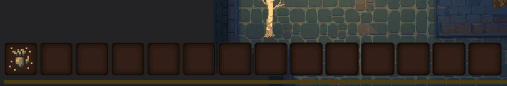
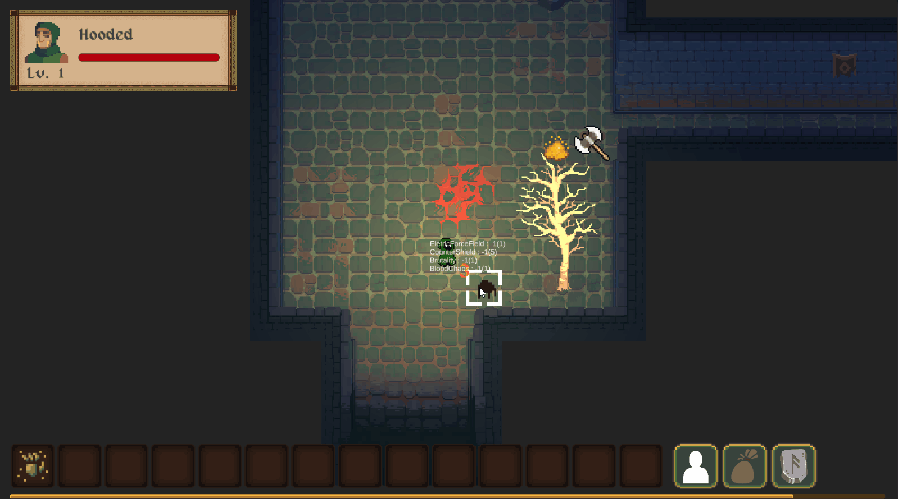

Greetings Everyone! 

The main tasks for this month include defining the primary attributes of the player in the game, as well as the connectivity between attributes and game systems. Additionally, the character upgrade system and experience UI have been added in this update! Finally, the throwing system for items has been fully implemented in this update, allowing players to skillfully throw their most powerful weapons at enemies in the game! Let's take a closer look at each of the updates:

## Attribute System

I've been thinking a lot lately about what attributes players need to have in the game. My game is heavily inspired by DND and Pixel Dungeon, so I want to keep the gameplay as simple as possible while still providing enough depth for players to explore various strategic configurations.

The characters will currently have five main basic attributes: STR, WIS, DEX, STA, and COG. Players familiar with DND will certainly be familiar with these contents. On the basis of these attributes, I have designed a series of distinctive game systems that are closely related to the characters' attributes. I hope that these attributes will not only affect the process and outcome of battles but also bring enough playability to other aspects of the game. After all, in the adventure process, you not only need to face difficult-to-deal-with enemies but also need to solve various traps and levels that may lead to death :P.

Of course, making good use of these attribute advantages sometimes leads players to discover unexpected treasures.

## Leveling System and Experience UI

In terms of the experience point system, I have currently set the maximum game level to 30, and roughly defined the experience points required between each level to achieve this goal. This is still a rough design outcome, and future revisions will be needed to improve the overall gaming experience. We have added an experience point gauge in the UI to allow players to easily track their character's growth progress. Additionally, I also introduced animation effects for level upgrades. However, I'm not entirely satisfied with the current upgrade animation, so I plan to replace it when time permits.

*It is about to leveling up!*

*Leveling up effect, huh.*

## Throwing System

The throwing system is one of the main focuses of this development cycle. I have conducted extensive research and design on the act of throwing in the game, including determining the maximum distance that can be reached when throwing, defining the effects of various items thrown to enhance the gameplay experience, and exploring whether a tactical style can be built around throwing items, among other aspects. Currently, we are still in the design phase, and I hope to reveal more development content to everyone next month!

---

Above is the sharing content for this month, and there are still many things in the planning stage. I am excited to implement these projects one by one and look forward to meeting everyone again next month!