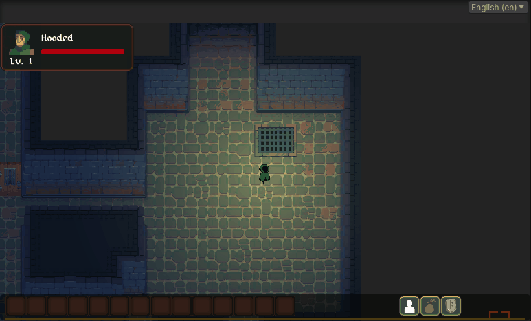
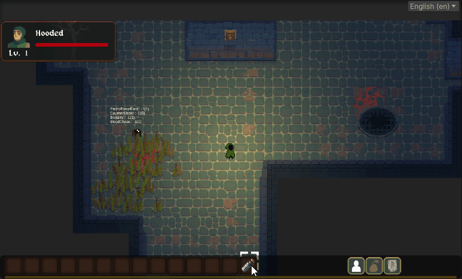
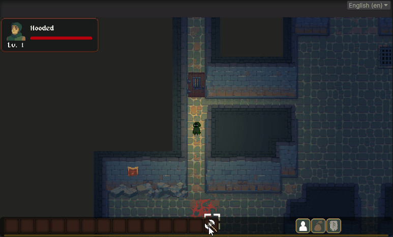
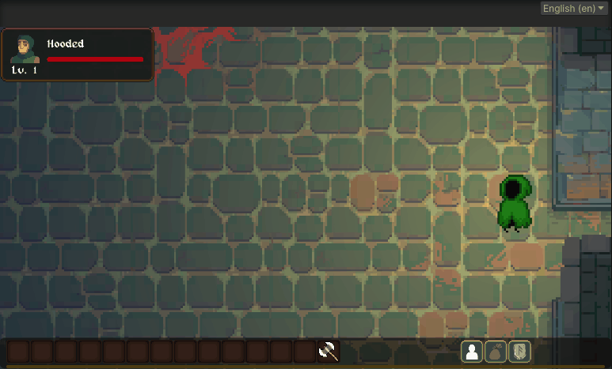

Greetings Everyone!  We are meeting again!

This month's primary development focus is on implementing the throwing system mentioned last month, as well as optimizing some programming-related tasks. Now, let's delve deeper into the throwing system:

## Throwing Abilty

In the game, characters can throw items to any location on the map. The distance an item can be thrown is influenced by the character's attributes and the type of item. The stronger the character's strength attribute, the farther they can throw items.
Strengthening a character's strength appropriately can provide unexpected assistance. In future expansions, certain talents may enhance the variety of items players can throw and the distance.

*Player can throwing inventory item to the map*

## Obstacle and throwing effect

Players can click on any location on the map to throw items. If the location selected by the player is beyond the character's maximum throwing distance, the system will automatically calculate the destination based on the direction of the throw.

During the throwing process, when an item encounters an obstacle, two scenarios may occur. Fragile items might be destroyed upon contact with the obstacle, and eventually triggering their effects upon shattering. Solid items, however, remain unaffected but may drop directly in front of the obstacle, failing to reach their intended throwing destination.

*Fragile item might explored upon hitting an obstacle.*

*However, solid item will land in front of obstacle.*

## The throwing effect of items.

For the cool throwing effect, I created two special animations for the items. During the flight of the item, it will randomly rotate clockwise or counterclockwise in the air, and when the item lands on the ground, there will be a small indicator animation to inform the player that the item has successfully reached its destination.

*Throwing effect, COOL!!*

---

That's all for the content related to the item throwing system this time. Additionally, there are some related systems that have been implemented, but they have not yet been designed for gameplay. In the future, there will be opportunities to present more interesting mechanisms.

## Others

Currently, my development process has been quite spontaneous, where I work on whatever comes to mind. Recently, I've started to implement a more organized approach by setting monthly goals, and so far, the results have been promising. In the future, I plan to adopt a bi-monthly development approach, with the first month focusing on expanding gameplay content and enhancing playability, while the second month will be dedicated to strengthening and optimizing the system itself. This approach will prioritize development tasks and hopefully lead to greater success for the project in the long run.

---

Above is the sharing content for this month, and there are still many things in the planning stage. I am excited to implement these projects one by one and look forward to meeting everyone again next month!