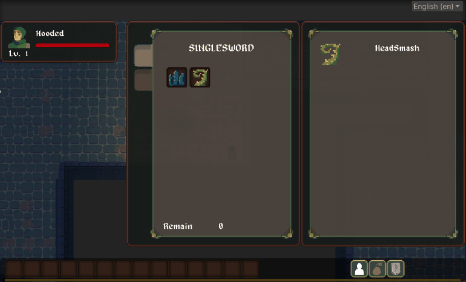
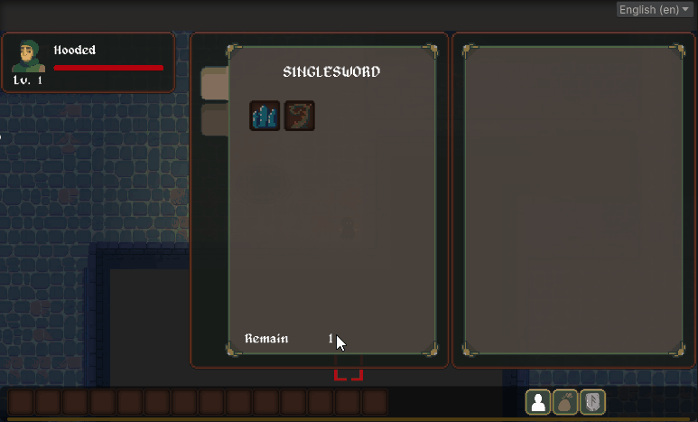
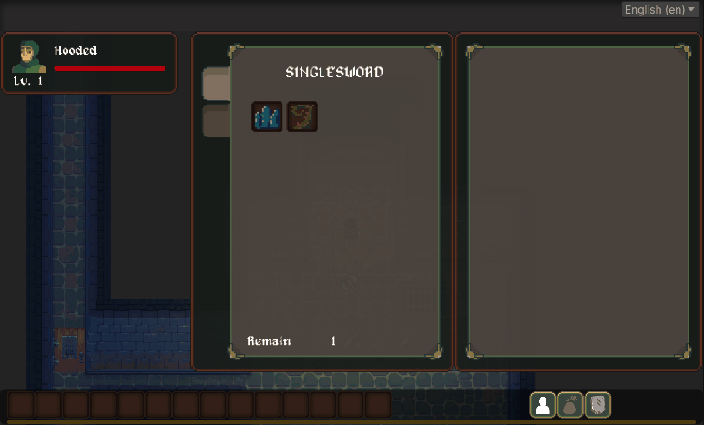
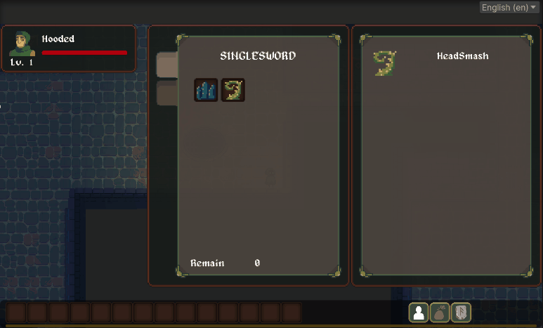

Greetings Everyone!  We are meeting again!

This month, the focus will be on designing the character's skill system and related GUI. Skills are a crucial component of the game system, and devising a unique skill system tailored to your game will pose a significant strategic challenge. Now, let's take a look at what's new this month:

## Ability System

During the game, players will level up by engaging in battles with monsters or completing certain quests, thereby earning skill points. These skill points can be used to enhance the player's desired special abilities.

Skills in the game are divided into various disciplines, and each character of a different profession can learn different disciplines. Some disciplines may even require certain conditions to be met in the game before they can be learned.

Each discipline is further divided into several levels of skills:

- Novice
- Proficient
- Expert
- Master

Different amounts of skill points are required to learn each level of skill, so managing the collected skill points wisely is also an important aspect of gameplay strategy.

## Ability GUI

In the bottom right corner of the game screen, clicking on the shortcut button for skills will bring up the skills panel. 

On the left side of the skills panel, the player's currently mastered skill disciplines are displayed along with all the skill items within each discipline. Players can view different skill categories by clicking on the faction labels on the left side. 

*Clicking on the faction labels to show different categories.*

Skills that have not been learned yet are shown in a darker color, while mastered skills are constantly brightened. Players can long-press on a skill icon to attempt to learn it, and if they have enough skill points, they can successfully acquire that skill.

*Long-press on the skill icon to learn that skill.*

On the right side of the skills panel, detailed information about the skill is presented, including its name, level, type, and effects. Players can examine the special effects of each skill in the skills panel to devise their own strategic plans.

*Click on the skill icon to display detailed information about that skill.*

## Setting Skills to Quick Slots

Players can assign acquired skills to quick slots for easy access during gameplay. To do this, open the skill panel and long-press on the active skill you want to assign. Then, drag the skill icon to the desired quick slot. If the skill can be assigned to a quick slot, you will see a floating skill icon while dragging. Simply release the icon onto the desired quick slot to complete the assignment.

*Assigning a skill to a quick slot by dragging.*

---

That's all for this month's development progress. The framework for the skill system has been largely completed. In the upcoming months, I will focus on designing the first playable class in the game. Stay tuned for more updates next month!