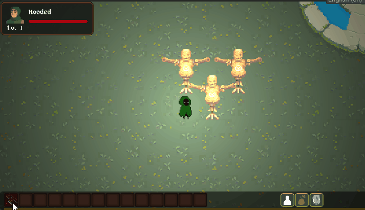

Greetings Everyone!  We are meeting again!

I've been absent for a while over the past few months, but development has never stopped! Recently, I've been focusing on the design of the first playable class – the Berserker. This includes the full skill mechanics of the Berserker, as well as the visual effects and icons for the skills. At the same time, I’ve also been working on the combat damage calculation process, making the damage more formulaic while ensuring it can accommodate the game's rich strategic elements. Let’s take a look at what changes have been made!

## Mechanism Design -- Career System

One of the key projects in September is the design of the career skill system. To ensure flexibility and quick changes when adjusting skill settings in the future, the system currently fully adopts Unity's ScriptableObject system to record skill detail settings. Since the effects of the skills are stored in a format similar to data files, one of the challenges in system design is determining how to use the fewest variables to cover all the attributes required for the skills. Additionally, to make the game's strategy sufficiently rich, another major challenge is ensuring that the system can accommodate complex talent logic.

The following are the currently designed moments when talent effects can be triggered:

- At the start of a turn,
- Before the character acts,
- After the character acts,
- After the turn ends,
- Before making an attack,
- Before receiving an attack,
- When health is restored,
- When health changes,
- When receiving damage,
- After receiving an attack,
- After making an attack, 
- ....

## New Profession -- Berserker

The Berserker is a powerhouse, a battle-obsessed fanatic who excels at unleashing brute force to ruthlessly attack enemies. The longer the Berserker stays in combat, the more energy—Rage—they accumulate, which can be used to execute various types of skills. Additionally, the Berserker is proficient in using axes and can throw melee weapons as projectiles. When a weapon successfully hits a target, it can also trigger the enchantment effects on the weapon.

Currently, the Berserker has ten skills:

| Name         | Type         | Cooldown | Cost  | Description                                                                                                                                                                   |
|:-------------|:-------------|:--------|:------|:-----------------------------------------------------------------------------------------------------------------------------------------------------------------------------|
| Savage Roar   | Active/Energy | 10      | TBD   | Lets out a piercing roar at surrounding enemies, with a **33%** chance to cause fear within a **6** yard radius, applying the **Fear** debuff                                  |
| Unstoppable   | Passive       | None    | None  | If the Berserker fails a stun or sleep saving throw, they can roll the saving throw one more time                                                                             |
| Burning Rage  | Passive       | None    | None  | After taking damage, the Berserker temporarily gains a **4%** damage boost, which stacks with each instance of damage, up to **5** stacks                                      |
| Brutal Strike | Passive       | None    | None  | When the Berserker triggers a critical hit, they deal an additional **30** critical damage                                                                                     |
| Berserk       | Active/Rage   | 30      | TBD   | The Berserker enters an unstoppable state, gaining **20%** damage for **8** turns and immunity to all control effects but reducing **10** dodge and **20** defense. Damage received during this period will be delayed and spread over **6** turns after the skill ends |
| Raging Charge | Active/Energy | 15      | TBD   | The Berserker charges in a straight line, attempting to dash to a location within **8** yards, damaging any enemies or destructible objects in their path. The charge stops if they hit an impassable obstacle (e.g., purely solid barriers) |
| Bloodthirsty  | Active/Rage   | 10      | TBD   | The Berserker consumes rage to heal themselves, recovering **15%** of their maximum health                                                                                      |
| Rage Infusion | Passive       | None    | None  | For every **5** points of rage, the Berserker gains a **1%** increased chance to trigger weapon effects when attacking                                                          |
| Reckless Strike | Active/Energy | TBD    | TBD   | The Berserker makes an all-out attack, dealing true damage that ignores all damage reduction but also suffers rebound damage. If the Berserker kills the enemy, no health is lost  |
| Rage of the Berserker | Passive | None   | None  | The Berserker gains attack speed and lifesteal based on lost health. For every 10% of health lost, they gain **2%** attack speed and **1%** lifesteal                          |
| Battle Instinct | Passive     | None    | None  | After dealing damage to an enemy, the Berserker's subsequent attacks/deployments deal an additional **5%** damage, lasting until they stop attacking or take damage             |

## Full implement of damage caculation

The skill damage design is heavily inspired by *Baldur's Gate 3* and *TOME4*. I find it really cool to incorporate different elemental effects into attacks. For example, a swordsman adept at controlling elemental forces could mix elemental damage into his strikes and have higher immunity to different elements compared to other classes. With a mechanism for increasing or decreasing elemental damage, the game's strategic depth is greatly enhanced. Players would need to devise specific strategies based on the enemy's weaknesses in order to effectively defeat them.

## Remake of Attack process

Players can assign acquired skills to quick slots for easy access during gameplay. To do this, open the skill panel and long-press on the active skill you want to assign. Then, drag the skill icon to the desired quick slot. If the skill can be assigned to a quick slot, you will see a floating skill icon while dragging. Simply release the icon onto the desired quick slot to complete the assignment.

## Damage Test -- Training Dummy

To allow players to test the power of regular attacks and the effects of skills, I have also designed an interactive element that should appear in every RPG — the training dummy! Players can try attacking the dummy to see how much damage they deal.

*What a greatful damage!*

---

The above content reflects the progress over the past few months. The basic mechanics of the game are gradually taking shape. Moving forward, I will start focusing on filling in the game content. Therefore, starting next month, I will be concentrating on designing the large world map and the game's levels. Thank you, everyone!