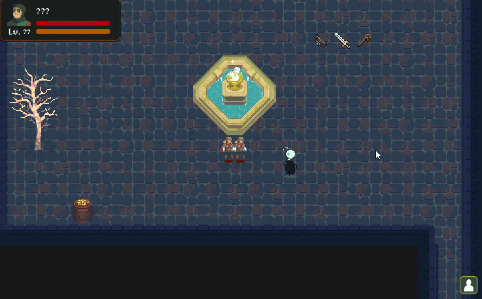
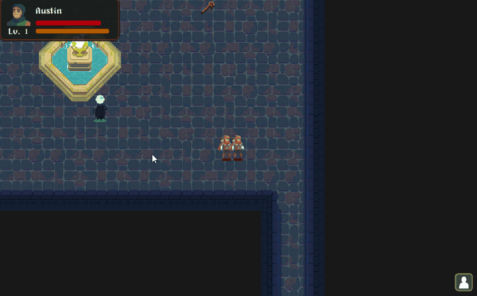

哈喽大家 好久不見! 這幾個月發生了很多事情，導致中途有短暫地離開原本的開發工作去處理一些私人事情。這陣子不管是在遊戲開發心態、人生觀、生活想法等各方面都改變了許多，讓自己用不一樣的角度去看待這個世界。而對於目前正在開發的遊戲，其遊玩類型與風格也出現了極大的變化 ☺️，因此本月份的文章想具體介紹一下遊戲類型有哪些轉變，以及更新一下目前 Demo 版本的進度!

## 遊戲類型變化 -- 由回合制 Roguelike 改變成即時制 Roguelike

這幾個月在遊戲內容改變上，變化最大的當屬於遊戲類型的重新定義。在先前設計關卡內容的階段，突然發現到若是紀續沿用原本的回合制遊玩方式，有許多富有趣味性且我自己很想要設計出來的遊戲內容可能就變得不那麼有味道，因此權衡再三之後，決定重新定義遊戲類型 -- 從回合制 Roguelike 改變成即時制 Roguelike! 為了迎合這一個改動，我不得不對遊戲的底層核心代碼做出大量改動，更多地利用 Unity 的原生物理引擎來設計遊戲內容的行為。

但當整體的架構改動地差不多時，我發現在當前框架中添加新內容的速度比起先前的版本來的快上許多，可能是由於 Unity 引擎的幫助，可以讓我更專注在設計遊戲內容上。我很喜歡這個面向上帶來的改變，也代表自己正在正確的道路上前進。

遊戲的遊玩方式改為即時制，可以引入許多新的遊戲體驗，例如:

- 透過鍵盤與滑鼠控制角色隊伍行為，讓玩家可以利用自身的反應速度與操作能力克服關卡

- 透過施放武器技能製造出飛行彈幕，玩家不僅要考慮施放時機，也要拿捏與敵方角色之間的距離以及方向

- 整合物理引擎，讓玩家角色更好的與關卡物件進行互動

還有許多許多尚未提及的設計想法，將陸續在未來的開發內容中與大家分享!

## 即將到來的 Demo 版本

歷經了這麼久的開發時間，終於要贏來 Aurora 的第一個 Demo 版本了! 在 Demo 版本中，玩家將可以操作 **3** 名隊伍角色，在特別設計的關卡中體驗一小部分遊戲內容。可以體驗到的部分包含道具掉落、裝備切換、使用武器技能，來克服數名敵方角色，以及一名最終 Boss! 透過以上內容，希望能讓玩家了解遊戲大致上的遊戲方式，並可以初步地穰玩家理解遊戲內容。

以上，就是這個月的分享內容，期待我們下個月的見面!