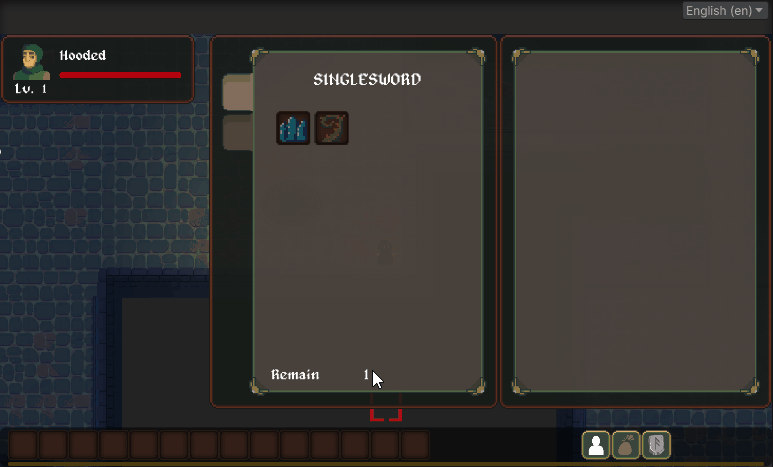
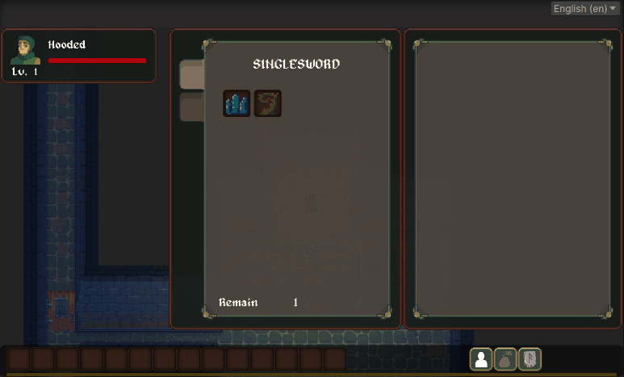

哈類大家!  我們又見面了!

這個月的重點將會放在角色的技能系統設計，以及技能相關的 GUI 設計上。技能是遊戲系統中的重要一環，如何正確地建立屬於自己的技能系統將會是遊戲中的一大策略考驗讓我們趕快來看看這個月又增加了哪些新東西:

## 技能系統

在遊戲的過程中，玩家將透過與怪物戰鬥提升等級，或是完成某些遊戲中的任務來獲得技能點數，這些技能點數可以用來提升玩家心儀的特殊能力。

遊戲中的技能分成許多流派，每個不同職業的角色可以學習的流派有所不同，有些流派甚至需要在遊戲中滿足某些條件才能夠進行學習。

每個流派底下的技能都被分成若干個等級，分別是:
入門級、熟練級、專家級、宗師級

學習每個等級的技能所需要的點數各有不同，因此如何妥善地運用蒐集而來的技能點數也是遊戲策略的重要一環。

## 技能面板

在遊戲畫面的右下角中，點選技能圖示的快捷按鈕即可彈出技能面板。在技能面板的左方分別顯示了玩家目前掌握的技能流派以及檢視流派底下的所有技能項目。玩家可以透過點選左方的流派標籤來檢視不同的流派內容。

*點選左方的流派標籤來顯示不同的流派內容*

尚未學習的技能會以較暗的顏色顯示，而已經掌握的技能則是會變成恆亮，玩家可以長按該技能圖示來嘗試學習，若是技能點數足夠，則可以成功習得該技能。

*長按技能圖示來學習該技能*

技能面板的右邊則呈現技能的詳細資訊，包含名稱、等級、技能種類與效果等等。玩家可以在技能面板中檢視各個技能的特殊效果，來制定自己心目中的策略。

*點擊技能圖示來顯示該技能的詳細資訊*

## 將技能設置道快捷欄位

玩家已經成功習得的技能可以設定到快捷欄位中，方便玩家在遊戲的過程中快速的施放技能能力。打開技能面板，並對著已經學習的主動技能長按並進行拖曳的動作，若是該技能可以設置到快捷欄位，則在拖曳的瞬間可以看到一個漂浮的技能圖示，接著玩家只要將其放置在喜歡的快捷欄位中便可以進行設定。

*透過拖曳的方式將技能設定到快捷欄位*

---

以上就是這個月的開發進度，目前技能系統的雛形已大致完成，在接下來的月分中，我將針對遊戲中第一個可遊玩的職業進行深入設計，期望下個月可以再為大家帶來更多的內容!